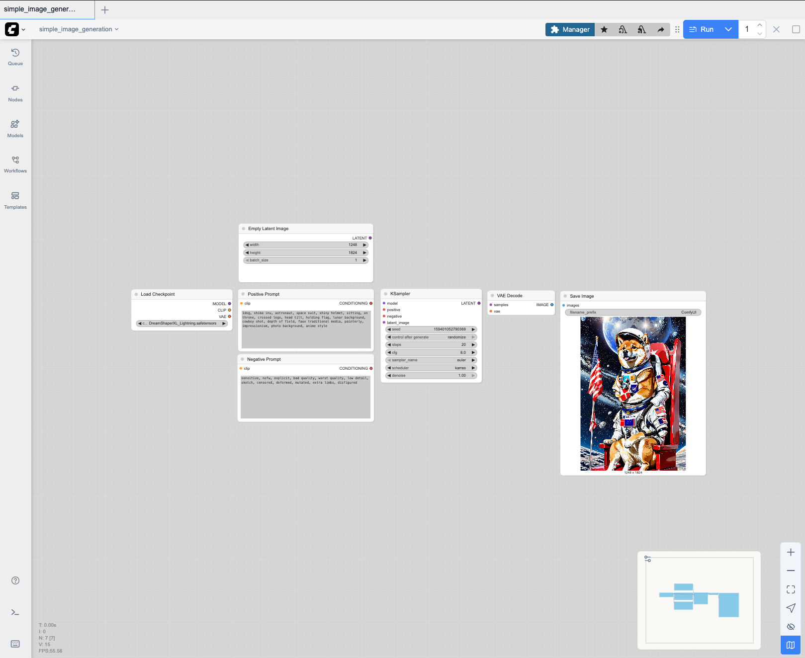
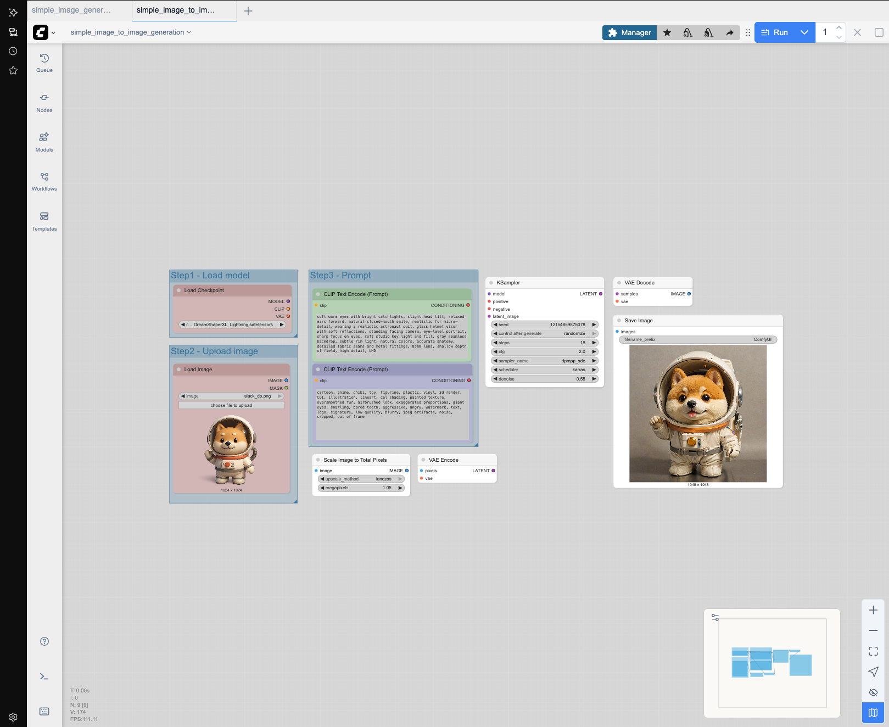

# GenAI-Lab-ComfyUi

This project is a lightweight testbed for running **[ComfyUI](https://github.com/comfyanonymous/ComfyUI)** on:

- Apple Silicon (M3, M2, M1) using **PyTorch MPS acceleration**  
- NVIDIA GPUs (e.g. RTX 4060 Ti) using **CUDA acceleration**

The goal is to spin up ComfyUI completely from scratch in an isolated conda environment, test example workflows, and benchmark performance across different hardware backends.

---

## Installation

### Requirements
- macOS (Apple Silicon M3 recommended) **OR** Linux with NVIDIA GPU (tested on RTX 4060 Ti, CUDA 12.1)  
- [conda](https://docs.conda.io/en/latest/) or [miniconda](https://docs.conda.io/en/latest/miniconda.html)  
- Git  

---

### Steps (Apple Silicon)

Absolutely—here’s a clean, copy-pasteable set of Apple-Silicon-friendly steps with the right PyTorch Nightly and ComfyUI bits wired up.

### ComfyUI on Apple Silicon (M-series)

1. **Clone the repo (with submodules)**

```bash
git clone --recurse-submodules https://github.com/<your-username>/GenAI-Lab-ComfyUi.git
cd GenAI-Lab-ComfyUi
```

2. **Create & activate a Conda env (Python 3.11)**

```bash
conda create -n comfyui-env python=3.11 -y
conda activate comfyui-env
```

3. **Install PyTorch Nightly (MPS)**

> Nightly is recommended for the latest MPS fixes on macOS.

```bash
pip install --pre torch torchvision torchaudio --index-url https://download.pytorch.org/whl/nightly/cpu
```

4. **Install ComfyUI dependencies**

```bash
# If the ComfyUI submodule folder is "comfyui" (lowercase—as in your repo):
pip install -r comfyui/requirements.txt
```

5. **(Optional) Quick MPS sanity check**

```bash
python - <<'PY'
import torch
print("PyTorch:", torch.__version__)
print("MPS available:", torch.backends.mps.is_available())
print("MPS built:", torch.backends.mps.is_built())
PY
```

6. **Run ComfyUI**

```bash
export PYTORCH_ENABLE_MPS_FALLBACK=1
# Helps avoid hard crashes when a node falls back to CPU.

python comfyui/main.py
# If you hit memory pressure on bigger graphs:
# python comfyui/main.py --lowvram
```

If you need the [manager button](https://github.com/Comfy-Org/ComfyUI-Manager/issues/55):
```bash
cd comfyui/custom_nodes
git clone https://github.com/ltdrdata/ComfyUI-Manager

cd ,,
python main.py
```


7. **Open the UI**

* After “Starting server”, open: `http://127.0.0.1:8188`

---

## Key Concepts in Image Generation (ComfyUI / SD)

| Term                               | What it is (simple)                                                  | Why it matters                                                                                   | Typical values / tips                                                                                                                          |
| ---------------------------------- | -------------------------------------------------------------------- | ------------------------------------------------------------------------------------------------ | ---------------------------------------------------------------------------------------------------------------------------------------------- |
| **KSampler**                       | The “image cooker” – denoises latent noise into an image.            | Controls how the image forms step-by-step.                                                       | • **Steps**: 20–35 (fast vs. detailed). <br>• **Sampler**: *Euler a / Beta* → crisp lines (anime). <br> *DPM++ 2M Karras* → smooth, realistic. |
| **CFG (Classifier-Free Guidance)** | How strictly the model follows your text prompt.                     | Balance between creativity and prompt accuracy.                                                  | SD1.5: 6–8, SDXL: 5–7. <br> Lower = more free, higher = rigid/overbaked.                                                                       |
| **Seed**                           | Starting random noise pattern.                                       | Reproducibility: same seed + same settings → same image.                                         | Example: `3534616310`. Change seed for variety.                                                                                                |
| **VAE (Encode/Decode)**            | The “compressor/decompressor” between pixels and model latent space. | Needed for img2img & final rendering. Wrong VAE = muddy colors.                                  | Use the **VAE matching your base model**. <br>• SD1.5: *vae-ft-mse-840000*. <br>• SDXL: built-in is usually fine.                              |
| **LoRA (Low-Rank Adapter)**        | A lightweight style/concept add-on.                                  | Lets you apply specific styles (anime, Slam Dunk) or characters without swapping the base model. | • Must match base family (SD1.5 ↔ SD1.5, SDXL ↔ SDXL). <br>• Strengths: UNet 0.6–0.9, TE 0.4–0.8. <br>• Stackable but keep total < \~1.5–1.8.  |
| **Refiner**                        | A second pass model (mainly SDXL / Hunyuan) that polishes details.   | Improves textures, faces, contrast.                                                              | Usually enabled at **high steps** (e.g. Hunyuan: 50 steps + refiner ON).                                                                       |
| **Denoise strength**               | (Img2Img only) How much to change the source image.                  | Controls how much of the original survives.                                                      | 0.3–0.55 = refine but keep structure. <br>0.6–0.8 = big changes.                                                                               |

---

### Preset Examples

| Setup         | CFG | Steps | Sampler       | Notes                                         |
| ------------- | --- | ----- | ------------- | --------------------------------------------- |
| **Hunyuan**   | 3.5 | 50    | (unspecified) | Refiner ON, very polished, slow but detailed. |
| **Qwen**      | 4   | 25    | Euler Beta    | Clean, fast, good for anime.                  |
| **Flux Krea** | 4.5 | 25    | Euler Beta    | Similar to Qwen but stronger guidance.        |


---

## Workflows

This repo includes a set of curated ComfyUI workflows to show a progression
from beginner to advanced use cases.

| # | Workflow                  | Description |
| - | ------------------------- | ------------------------- |
| 1 | [Text to Image Generation](#1-text-to-image-generation)   | Very Simple Text to Image Generation using existing templates. |

---

### 1. Text to Image Generation

This is directly using the templates as a starting point. You can download the models through Huggingface:

* [Lykon / dreamshaper-xl-1-0](https://huggingface.co/Lykon/dreamshaper-xl-1-0) — a Stable Diffusion XL-based model tuned for artistic, anime and photorealistic styles. ([Hugging Face][1])
* [Lykon / dreamshaper-xl-lightning](https://huggingface.co/Lykon/dreamshaper-xl-lightning) — a variant of DreamShaper XL optimized for faster generation. ([Hugging Face][2])
* [black-forest-labs/FLUX.1-dev](https://huggingface.co/black-forest-labs/FLUX.1-dev) — a powerful text-to-image model capable of realistic output, part of the FLUX model series. ([Hugging Face][3])
* [Kwai-Kolors/Kolors](https://huggingface.co/Kwai-Kolors/Kolors) — designed for photorealistic image generation. ([Hugging Face][3])
* [Qwen/Qwen-Image](https://huggingface.co/Qwen/Qwen-Image) — a versatile model that handles multiple artistic styles and general text-to-image generation. ([Hugging Face][4])




### 2. Image to Image Generation

This is using Image to Image template, playing around with different knobs and trying to understand the influence.

- Guidance:

| Parameter                    | Controls                                                  | Typical values                                                                                     | Use lower when…                               | Use higher when…                                   | Notes                                                                                                          |
| ---------------------------- | --------------------------------------------------------- | -------------------------------------------------------------------------------------------------- | --------------------------------------------- | -------------------------------------------------- | -------------------------------------------------------------------------------------------------------------- |
| **seed**                     | Starting noise (repeatability vs. variation)              | Any integer                                                                                        | You want exact A/B tests (keep the same seed) | You want a new composition/variation (change seed) | Same seed + same settings ⇒ identical image.                                                                   |
| **control\_after\_generate** | What to do with the seed after each run                   | `fixed` · `increment` · `randomize`                                                                | You’re testing one knob at a time (`fixed`)   | You want auto-variation per click (`randomize`)    | `increment` = small controlled variations.                                                                     |
| **steps**                    | Number of denoising iterations (“polish time”)            | **SDXL:** 22–28 · **Lightning:** 4–12 · **SD1.5:** 26–34                                           | Output overcooked/slow                        | Image under-detailed/muddy                         | Diminishing returns past \~30 (non-Lightning).                                                                 |
| **cfg** (guidance)           | How strongly the prompt is enforced                       | **SDXL:** 5–6.5 · **Lightning:** 1.8–3.0 · **SD1.5:** 6–8                                          | Colors/edges look crunchy; faces distort      | Prompt isn’t followed; composition drifts          | Adjust in small steps (±0.5). Too high ⇒ artifacts.                                                            |
| **sampler\_name**            | The denoising algorithm (trajectory through noise)        | Common: `dpmpp_2m`, `dpmpp_sde`, `euler_ancestral`                                                 | You see grain/instability                     | You need cleaner results at low steps              | Safe defaults: **`dpmpp_2m`** (general), **`dpmpp_sde`** (Lightning), **`euler_ancestral`** (fast/anime look). |
| **scheduler**                | How noise levels are distributed across steps             | `karras` (recommended), `normal`                                                                   | Details look uneven/soft                      | You want crisper detail at same steps              | Use **`karras`** with DPM++ almost always.                                                                     |
| **denoise** *(img2img only)* | How far to push away from the source (style vs. likeness) | **Balanced:** 0.35–0.55 · **Subtle edit:** 0.2–0.3 · **Heavy restyle:** 0.6–0.8 · **txt2img:** 1.0 | You’re losing identity/composition            | You need stronger restyle/scene change             | Start \~**0.50**; lower for likeness, raise for style.                                                         |

**Quick presets:**

* **SDXL (standard):** `dpmpp_2m + karras`, steps **22–28**, cfg **5–6.5**, denoise **0.40–0.55** (img2img).
* **SDXL Lightning:** `dpmpp_sde + karras`, steps **4–12**, cfg **1.8–3.0**, denoise **0.45–0.55** (img2img).
* **SD1.5 (anime/manga):** `euler_ancestral` or `dpmpp_2m` + `karras`, steps **26–34**, cfg **6–8**, denoise **0.40–0.55**.




## Cloud Deployment

Investigation